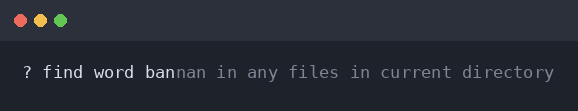
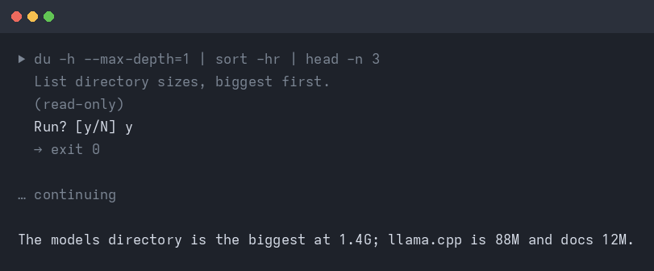
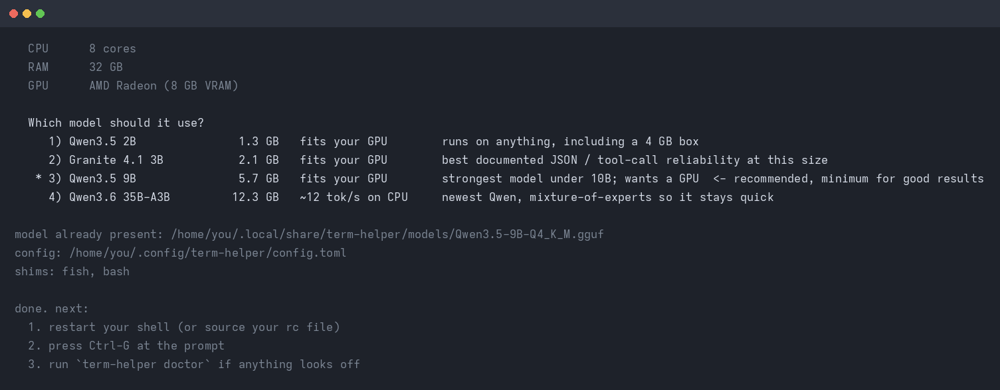
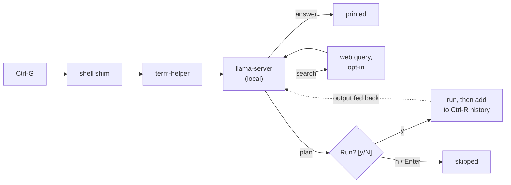

# terminal-helper

A small helper that sits at your shell prompt. Press a key, ask for something,
and a local model either answers or hands you the commands to do it. Every
command is printed first and waits for a `y`. Nothing runs on its own.

Everything stays on this machine. The model runs locally through
[llama.cpp](https://github.com/ggml-org/llama.cpp), so there is no account, no
cloud key and no telemetry. Web search is the one exception, and it is off until
you turn it on.



## Keys

| key | |
|---|---|
| `Ctrl+G` | ask |
| `Ctrl+Y` | ask with a bigger token budget, for harder questions |
| `Ctrl+C` | cancel |

`Alt+;` and `Alt+:` do the same thing, but only if your terminal and keyboard
layout pass `Alt` through. On layouts where `;` needs Shift (Norwegian, German,
…) stick with the `Ctrl` keys. If a key doesn't fire, run `term-helper keys` and
it will show you exactly what your terminal sends.

## What it does

- Answers questions about your machine: *what's using port 8080?*
- Answers plain questions too, like *what is a hardlink?* It decides on its own
  whether to answer or to plan.
- Turns a request into shell commands, each with a short reason.
- Asks before running anything. Enter or `n` skips a step.
- Puts what it ran into your shell history, so `Ctrl+R` finds it later.
- Searches the web when it needs current facts, if you've turned that on.

It won't run things unattended, and it won't quietly send your work to a cloud
model.

## Examples

### Ask for a command

Press `Ctrl+G`, type, press Enter:

```
? what's using port 8080?

  ▶ ss -ltnp 'sport = :8080'
    show the process listening on port 8080
    (read-only)

  Run? [y/N] y
  LISTEN 0 4096 127.0.0.1:8080 0.0.0.0:* users:(("llama-server",pid=4242,fd=9))
```

It can plan a few steps at a time when the job needs it:

```
? find the five biggest files under here and show me what they are

  ▶ find . -type f -printf '%s\t%p\n' | sort -rn | head -n 5
    list the five largest files by size
    (read-only)

  Run? [y/N] y
  12884901888  ./backups/old-home.tar
  4681510912   ./models/qwen2.5-coder-7b-instruct-q4_k_m.gguf
  ...

  ▶ file ./backups/old-home.tar
    identify what the biggest file actually is
    (read-only)

  Run? [y/N] y
  ./backups/old-home.tar: POSIX tar archive
```

### When it just answers

No commands, no approval prompt, just an answer:

```
? what's the difference between a hardlink and a symlink?

  A hardlink is another name for the same inode, so the two names are truly
  equal and either one can be deleted without losing the data. A symlink is a
  separate file that points at a path; delete the target and the symlink dangles.
```

### Searching the web

If you've enabled search, the model reaches for it only when it needs something
current. You'll see the query before the answer:

```
? what's the latest stable linux kernel version?

  ↗ web search (DuckDuckGo): latest stable linux kernel version
  The latest stable release is ...
```

### When you say no

```
? clean up the .tmp files in here

  ▶ find . -name '*.tmp' -delete
    delete temporary files in this directory
    ! destructive

  Run? [y/N] n
    (skipped)
```



## Install

```sh
./install.sh
```

It looks at your CPU, RAM and GPU, recommends a model, and downloads it.



Then restart your shell and press `Ctrl+G`.

## Models

`install.sh` picks one of these based on what you're running:

| | model | file | needs |
|---|---|---|---|
| tiny | Qwen3.5 2B | 1.2 GB | any machine, 4 GB RAM |
| small | Granite 4.1 3B | 2.0 GB | 4 GB RAM |
| medium | Qwen2.5-Coder 7B | 4.4 GB | 8 GB RAM, ideally a GPU |
| large | Qwen2.5-Coder 14B | 8.4 GB | 16 GB RAM + 12 GB VRAM to be quick |

On a 16 GB AMD desktop GPU the 14B generates at around 37 tok/s. On CPU alone
it's closer to 3 tok/s, which is not pleasant. If you have no GPU, pick a small
model.

## Web search

Off by default. Turn it on in `~/.config/term-helper/config.toml`:

```toml
[general]
web_search = true
```

Then the model can ask for a search when a question needs current facts. The
helper runs the query, hands the results back, and the model answers. Only the
query text leaves your machine, not your files or shell history. Every search is
printed with `↗` so you can see it happen.

The default backend is DuckDuckGo: free, no account. If you'd rather use Kagi,
set `kagi_api_key` in the config (or the `KAGI_API_KEY` environment variable).
One thing worth knowing: Kagi's Search API is billed per request, separately
from a Kagi subscription, at roughly 1.2¢ per query.

## Security

The local model server is bound to loopback only. `base_url` has to be
`127.0.0.1`, `::1` or `localhost`; anything else is refused, and flags that would
re-expose it are rejected too.

On top of that, the systemd unit denies all network traffic except localhost,
turns off llama.cpp's web UI and slot monitoring, and runs with
`NoNewPrivileges`, `ProtectSystem=strict` and `ProtectHome=read-only`.

Every request is authenticated with a per-user API key that's generated at
install time and kept at mode `0600` in the state directory. That means a web
page or another process on your machine can't just knock on the port and drive
the model.

## Honest limitations

- **The model is small and gets things wrong.** Read a command before you press
  `y`. The approval step is there precisely because the model can't be trusted
  on its own.
- **It can invent file paths.** If a step offers to read a file, check the path.
- **No cloud model fallback.** If the local model can't do it, it can't do it.
- **Web search is opt-in.** With it off, nothing leaves the machine. With it on,
  the search query does.
- **It holds VRAM.** A running `llama-server` keeps the model loaded. If
  something else needs the VRAM, llama.cpp quietly falls back to CPU and gets
  much slower.
- **Tested on CachyOS/Arch with fish and bash.** The zsh shim is there and
  syntax-checked, but less exercised. Other distros should be fine: the core is
  stdlib Python, and the shims only touch shell history and the line editor.

## Command line

```
term-helper setup                 # detect hardware, pick and download a model
term-helper ask [--deep] [--dry-run] [--yes]
term-helper server {start,stop,status}
term-helper models {list,pull}
term-helper log [--tail N] [--runs]
term-helper doctor                # check binary, model, server, shims
term-helper keys                  # what does this keypress send?
term-helper install / uninstall   # re-wire or remove the shell shims
```

## How it works



The model is asked for one JSON object: an answer, a plan, or a search query. A
plan is a list of steps, each with a command, a reason and a risk hint. A JSON
schema constrains the decoding, so the reply is always parseable. The risk label
is only a hint, never a permission. You are the one who approves.

## Design

The vocabulary lives in [`GLOSSARY.md`](GLOSSARY.md) and the decisions are
recorded as ADRs in [`docs/adr/`](docs/adr/): local-only, llama.cpp as the
backend, every command approved, a JSON-schema contract, and a shell-agnostic
core with thin shims.

The core (`term_helper/`) is Python 3.11+ and standard library only.
`term_helper/policy.py` labels commands read-only or state-changing purely to
inform your decision. It gates nothing.

## License

Public domain, via [the Unlicense](LICENSE). Take it and do whatever you want.

