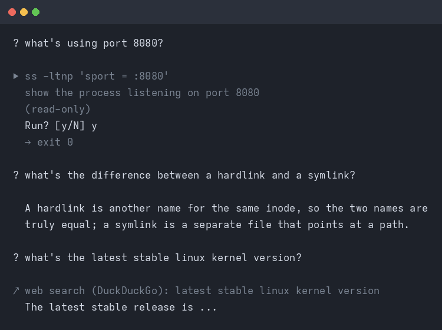
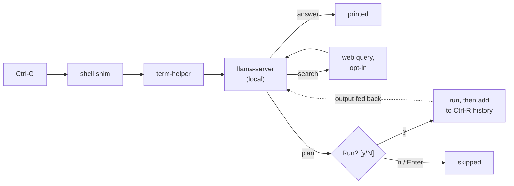

# terminal-helper

A small helper that sits at your shell prompt. Press a key, ask for something,
and a local model either answers or hands you the commands to do it. Every
command is printed first and waits for a `y`. Nothing runs on its own.

It runs on your machine through [llama.cpp](https://github.com/ggml-org/llama.cpp),
so there is no account, no cloud key and no telemetry. Web search is the one
exception, and it is off until you turn it on.



## Keys

| key | |
|---|---|
| `Ctrl+G` | ask |
| `Ctrl+Y` | ask with a bigger token budget, for harder questions |
| `Ctrl+C` | cancel |

`Alt+;` and `Alt+:` do the same, but only if your terminal and keyboard layout
pass `Alt` through. On layouts where `;` needs Shift (Norwegian, German, …) use
the `Ctrl` keys. If a key doesn't fire, `term-helper keys` shows exactly what
your terminal sends.

## Examples

Press `Ctrl+G`, type, press Enter. You get one of three things: a command to
approve, a plain answer, or a web search.

### A command


```
? what's using port 8080?

  ▶ ss -ltnp 'sport = :8080'
    show the process listening on port 8080
    (read-only)

  Run? [y/N] y
  LISTEN 0 4096 127.0.0.1:8080 0.0.0.0:* users:(("llama-server",pid=4242,fd=9))
```

It plans a few steps when the job needs it:

```
? find the five biggest files under here and show me what they are

  ▶ find . -type f -printf '%s\t%p\n' | sort -rn | head -n 5
    list the five largest files by size
    (read-only)

  Run? [y/N] y
  12884901888  ./backups/old-home.tar
  4681510912   ./models/qwen2.5-coder-7b-instruct-q4_k_m.gguf
  ...

  ▶ file ./backups/old-home.tar
    identify what the biggest file actually is
    (read-only)

  Run? [y/N] y
  ./backups/old-home.tar: POSIX tar archive
```

### An answer

```
? what's the difference between a hardlink and a symlink?

  A hardlink is another name for the same inode, so the two names are truly
  equal; a symlink is a separate file that points at a path.
```

### When it needs to look

If the answer depends on your setup, it reads the files first instead of
guessing. Reads are local, so they don't ask for approval:

```
? how is git configured on this machine?

  ↳ read ~/.gitconfig
  ↳ read .git/config
  ...
```

### A web search

```
? what's the latest stable linux kernel version?

  ↗ web search (DuckDuckGo): latest stable linux kernel version
  The latest stable release is ...
```

### A declined command

```
? clean up the .tmp files in here

  ▶ find . -name '*.tmp' -delete
    delete temporary files in this directory
    ! destructive

  Run? [y/N] n
    (skipped)
```


## Install

From a checkout:

```sh
./install.sh
```

Or straight from GitHub, no clone:

```sh
curl -fsSL https://raw.githubusercontent.com/kxzl/terminal-helper/main/install.sh | sh
```

It looks at your CPU, RAM and GPU, recommends a model, and downloads it. When
run from a URL it fetches a checkout into `~/.local/share/term-helper/src`
first.


Then restart your shell and press `Ctrl+G`.

Re-run `./install.sh` any time to upgrade. It refreshes the shims and the
systemd unit and keeps your config and models. To remove the shims, unit and
launcher, run `./uninstall.sh`; your config and models are left in place.

## Models

`install.sh` picks one of these based on what you're running:

| | model | file | needs |
|---|---|---|---|
| tiny | Qwen3.5 2B | 1.3 GB | any machine, 4 GB RAM |
| small | Granite 4.1 3B | 2.1 GB | 4 GB RAM |
| medium | Qwen3.5 9B | 5.7 GB | 8 GB RAM, ideally a GPU |
| large | Qwen3.6 35B-A3B | 12.3 GB | 16 GB RAM + 12 GB VRAM to be quick |

The large model is a mixture-of-experts, so only about 3B parameters are active
per token; it stays usable even when part of it runs on CPU. If you have no GPU,
pick a small model: CPU-only generation is a few tokens a second.

## Web search

Off by default. Turn it on in `~/.config/term-helper/config.toml`:

```toml
[general]
web_search = true
```

Then the model can search when a question needs current facts. Only the query
text leaves your machine, not your files or shell history, and every search is
printed with `↗` so you can see it happen.

The default backend is DuckDuckGo: free, no account. To use Kagi instead, set
`kagi_api_key` in the config (or the `KAGI_API_KEY` environment variable). Note
that Kagi's Search API is billed per request, separately from a Kagi
subscription, at roughly 1.2¢ per query.

## Security

The local model server is bound to loopback only. `base_url` has to be
`127.0.0.1`, `::1` or `localhost`, and flags that would re-expose it are refused.

The systemd unit denies all network traffic except localhost, turns off
llama.cpp's web UI and slot monitoring, and runs with `NoNewPrivileges`,
`ProtectSystem=strict` and `ProtectHome=read-only`. Every request is
authenticated with a per-user API key generated at install time and kept at mode
`0600` in the state directory, so a web page or another process can't just knock
on the port and drive the model.

File reads the model asks for happen automatically and stay on this machine.
Only commands need approval, and only web search leaves the machine.

## Honest limitations

- **The model is small and gets things wrong.** Read a command before you press
  `y`. The approval step is there precisely because the model can't be trusted
  on its own.
- **It reads files on its own.** When a question depends on your setup, the
  model reads the relevant files to answer instead of guessing. Reads are local
  and side-effect free, so they run without a prompt — but it may read a path
  you didn't intend. Commands always ask first.
- **No cloud model fallback.** If the local model can't do it, it can't do it.
- **Web search is opt-in.** With it off, nothing leaves the machine. With it on,
  the search query does.
- **It holds VRAM.** A running `llama-server` keeps the model loaded. If
  something else needs the VRAM, llama.cpp quietly falls back to CPU and gets
  much slower.
- **Tested on CachyOS/Arch with fish and bash.** The zsh shim is there and
  syntax-checked, but less exercised. Other distros should be fine: the core is
  stdlib Python, and the shims only touch shell history and the line editor.

## Under the hood



The model is asked for one JSON object: an answer, a plan, or a search query. A
plan is a list of steps, each with a command, a reason and a risk hint. A JSON
schema constrains the decoding, so the reply is always parseable. The risk label
is only a hint, never a permission.

The CLI:

```
term-helper setup                 # detect hardware, pick and download a model
term-helper ask [--deep] [--dry-run] [--yes]
term-helper server {start,stop,status}
term-helper models {list,pull}
term-helper log [--tail N] [--runs]
term-helper doctor                # check binary, model, server, shims
term-helper keys                  # what does this keypress send?
term-helper install / uninstall   # re-wire or remove the shell shims
```

The vocabulary lives in [`GLOSSARY.md`](GLOSSARY.md) and the decisions are
recorded as ADRs in [`docs/adr/`](docs/adr/): local-only, llama.cpp as the
backend, every command approved, a JSON-schema contract, and a shell-agnostic
core with thin shims. The core (`term_helper/`) is Python 3.11+ and standard
library only.

## License

Public domain, via [the Unlicense](LICENSE). Take it and do whatever you want.
