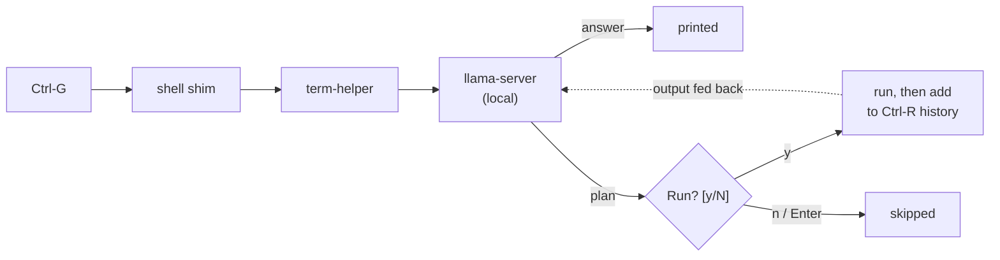

# terminal-helper

Press a key at your shell prompt, ask a question, and a local model either
answers it or proposes shell commands — each one shown for approval before it
runs.

Strictly local. Nothing leaves the machine.


## What it does

- **Answers** questions about your machine — *"what's using port 8080?"*
- **Proposes commands** for what you asked, with a one-line reason for each.
- **Asks first.** Every command is printed and confirmed with `y/N`; Enter or
  `n` skips it.
- **Records what ran** in your shell history, so `Ctrl+R` finds it later.
- **Runs offline**, against a local [llama.cpp](https://github.com/ggml-org/llama.cpp)
  model. No account, no API key, no telemetry.

What it deliberately does *not* do: run anything unattended, call the cloud, or
pretend to be autonomous.


## How it works



The model is asked for a single JSON object — either an answer, or a list of
steps, each with a command, a reason and a risk hint. A JSON schema constrains
decoding, so the reply is always parseable. The model's risk label is a hint,
never a permission: you are the one who approves.

## Install

```sh
./install.sh
```

It detects your CPU, RAM and GPU, recommends a model, and downloads it.


Then restart your shell and press **`Ctrl+G`**.

| key | |
|---|---|
| `Ctrl+G` | ask |
| `Ctrl+Y` | ask, with a larger token budget |
| `Ctrl+C` | cancel |

`Alt+;` / `Alt+:` also work, but only where your keyboard layout and terminal
pass `Alt` through. On layouts where `;` needs Shift (Norwegian, German, …) use
the `Ctrl` keys. If a binding doesn't fire, `term-helper keys` shows exactly
what your terminal sends.

## Models

`install.sh` picks one of these by your specs:

| | model | file | needs |
|---|---|---|---|
| tiny | Qwen3.5 2B | 1.2 GB | any machine, 4 GB RAM |
| small | Granite 4.1 3B | 2.0 GB | 4 GB RAM |
| medium | Qwen2.5-Coder 7B | 4.4 GB | 8 GB RAM, ideally a GPU |
| large | Qwen2.5-Coder 14B | 8.4 GB | 16 GB RAM + 12 GB VRAM to be quick |

On a 16 GB AMD desktop GPU the 14B generates at ~37 tok/s. On CPU only it is
~3 tok/s, which is too slow to be pleasant — pick a small model if you have no
GPU.

## Honest limitations

- **Small models make mistakes.** Read the command before you press `y`. The
  approval step exists precisely because the model is not reliable on its own.
- **`reads` can invent paths.** If a step offers to read a file, check the path.
- **No cloud fallback.** If the local model can't do it, it can't do it.
- **Tested on CachyOS/Arch with fish.** zsh and bash shims exist and are
  syntax-checked, but are less exercised. Other distros should work — the Core
  is stdlib Python and the shims only touch shell history and the line editor.
- **It holds VRAM.** A resident `llama-server` keeps the model loaded. If
  something else takes the VRAM, llama.cpp silently falls back to CPU and gets
  much slower.

## Commands

```
term-helper setup                 # detect hardware, pick + download a model
term-helper ask [--deep] [--dry-run] [--yes]
term-helper server {start,stop,status}
term-helper models {list,pull}
term-helper log [--tail N] [--runs]
term-helper doctor                # check binary, model, server, shims
term-helper keys                  # what does this keypress send?
term-helper install / uninstall   # re-wire or remove the shell shims
```

## Design

The vocabulary is in [`GLOSSARY.md`](GLOSSARY.md); the decisions are recorded as
ADRs in [`docs/adr/`](docs/adr/) — local-only, llama.cpp as the backend, every
command approved, JSON-schema contract, shell-agnostic Core with thin shims.

The Core (`term_helper/`) is Python 3.11+, standard library only. `term_helper/policy.py`
labels commands read-only or state-changing purely to inform your decision; it
gates nothing.
